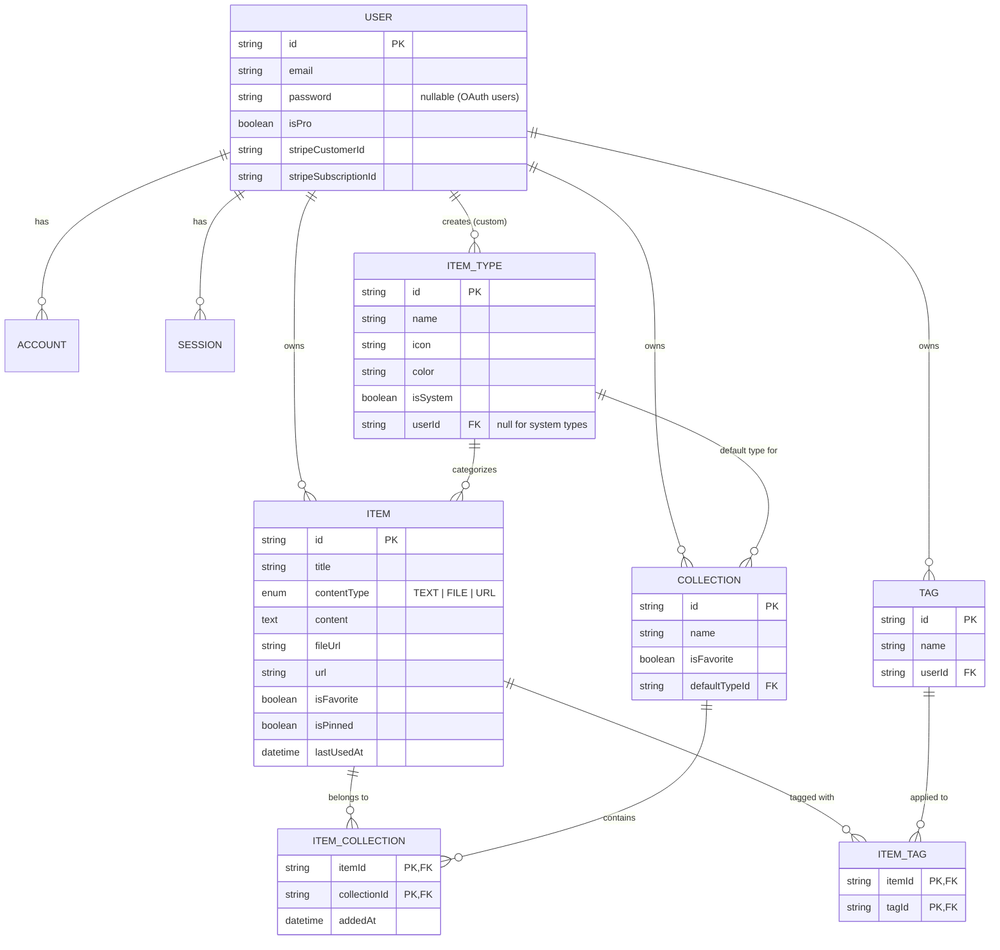
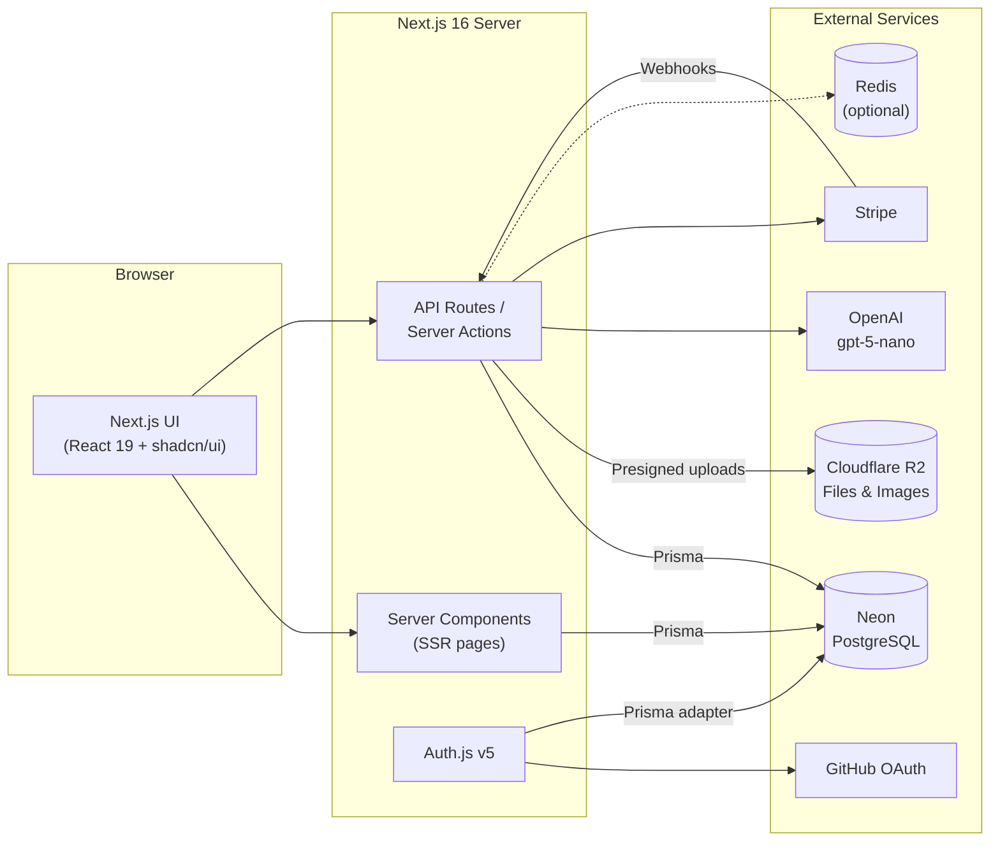
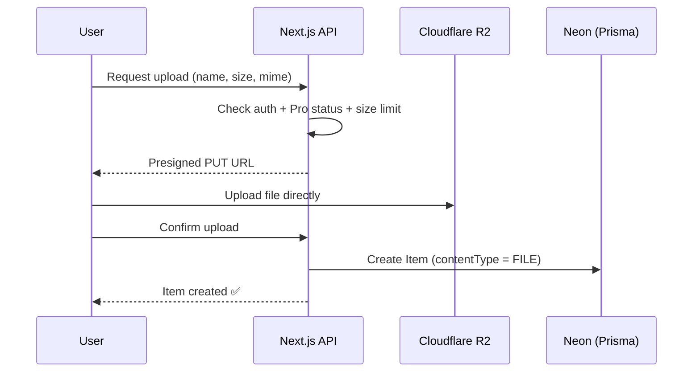

# 🗃️ DevStash — Project Overview

> **One fast, searchable, AI-enhanced hub for all your developer knowledge & resources.**

---

## Table of Contents

1. [Problem](#-problem)
2. [Target Users](#-target-users)
3. [Features](#-features)
4. [Data Model](#-data-model)
5. [Prisma Schema](#-prisma-schema)
6. [Tech Stack](#-tech-stack)
7. [Architecture](#-architecture)
8. [Routes](#-routes)
9. [Monetization](#-monetization)
10. [UI / UX](#-ui--ux)
11. [Development Rules](#-development-rules)
12. [Open Questions](#-open-questions)

---

## 🧩 Problem

Developers keep their essentials scattered across many tools:

| Resource            | Where it usually lives       |
| ------------------- | ---------------------------- |
| Code snippets       | VS Code, Notion              |
| AI prompts          | Buried in chat histories     |
| Context files       | Deep inside project folders  |
| Useful links        | Browser bookmarks            |
| Docs                | Random folders               |
| Commands            | `.txt` files                 |
| Project templates   | GitHub Gists                 |
| Terminal commands   | Bash history                 |

This leads to **context switching**, **lost knowledge**, and **inconsistent workflows**.

**DevStash** solves this by providing a single place to save, organize, search, and reuse all of it.

---

## 👥 Target Users

| Persona                          | Primary Need                                              |
| -------------------------------- | --------------------------------------------------------- |
| 🧑‍💻 **Everyday Developer**        | Quickly grab snippets, prompts, commands, and links       |
| 🤖 **AI-first Developer**         | Save prompts, context files, workflows, system messages   |
| 🎓 **Content Creator / Educator** | Store code blocks, explanations, and course notes         |
| 🏗️ **Full-stack Builder**         | Collect patterns, boilerplates, and API examples          |

---

## ✨ Features

### A. Items & Item Types

Every piece of saved content is an **Item**, and every item has a **Type**. DevStash ships with a fixed set of **system types** (cannot be edited or deleted). Users will be able to create **custom types** later (Pro).

| Type    | Content Kind | Icon (Lucide) | Color     | Plan | Route            |
| ------- | ------------ | ------------- | --------- | ---- | ---------------- |
| Snippet | `TEXT`       | `Code`        | `#3b82f6` 🔵 | Free | `/items/snippets` |
| Prompt  | `TEXT`       | `Sparkles`    | `#8b5cf6` 🟣 | Free | `/items/prompts`  |
| Note    | `TEXT`       | `StickyNote`  | `#fde047` 🟡 | Free | `/items/notes`    |
| Command | `TEXT`       | `Terminal`    | `#f97316` 🟠 | Free | `/items/commands` |
| Link    | `URL`        | `Link`        | `#10b981` 🟢 | Free | `/items/links`    |
| File    | `FILE`       | `File`        | `#6b7280` ⚪ | Pro  | `/items/files`    |
| Image   | `FILE`       | `Image`       | `#ec4899` 🩷 | Pro  | `/items/images`   |

- **Text types** use a Markdown editor (with syntax highlighting for code).
- **URL types** store a link plus optional description.
- **File types** upload to Cloudflare R2.
- Items open and are created in a **quick-access drawer** — no full page navigation required.

### B. Collections

- Users create collections that can hold items of **any type**.
- An item can belong to **multiple collections** (many-to-many), e.g. a React snippet in both *React Patterns* and *Interview Prep*.
- Items show which collections they belong to, and can be added/removed from several at once.

Example collections:

| Collection       | Typical Contents  |
| ---------------- | ----------------- |
| React Patterns   | Snippets, Notes   |
| Context Files    | Files             |
| Python Snippets  | Snippets          |

### C. Search

Fast search across:

- ✅ Titles
- ✅ Content
- ✅ Tags
- ✅ Types

> Starting point: PostgreSQL full-text search (`tsvector`) or `ILIKE` via Prisma. Can be upgraded later (e.g. `pg_trgm` for fuzzy matching).

### D. Authentication

- 📧 Email / password (hashed with bcrypt or argon2)
- 🐙 GitHub OAuth

### E. Core Features

- ⭐ Favorite items and collections
- 📌 Pin items to top
- 🕒 Recently used items
- 📥 Import code from a file
- 📝 Markdown editor for text types
- 📤 File upload for file/image types
- 📦 Export data (JSON / ZIP)
- 🌙 Dark mode by default, light mode optional
- 🔗 Add/remove items to/from multiple collections
- 👀 View which collections an item belongs to

### F. AI Features (Pro)

Powered by **OpenAI `gpt-5-nano`**.

| Feature                 | Description                                              |
| ----------------------- | -------------------------------------------------------- |
| 🏷️ Auto-tag suggestions | Suggests tags based on item content                      |
| 📄 AI Summaries          | Short summaries of notes, files, and long content        |
| 💡 Explain This Code     | Plain-English explanation of a snippet or command        |
| ✨ Prompt Optimizer      | Rewrites prompts to be clearer and more effective        |

---

## 🗂️ Data Model

### Entity Relationship Diagram



### Key Decisions

- **System types** have `userId = null` and `isSystem = true`. They are seeded, never user-editable.
- **Tags are scoped per user** (`@@unique([userId, name])`) so users don't share/leak tag names.
- **`lastUsedAt`** on `Item` powers the *Recently Used* view (updated when an item is opened or copied).
- **`contentType`** has three values (`TEXT`, `FILE`, `URL`) to match the three kinds of types in the spec.
- **Cascading deletes**: deleting a user removes all their data; deleting a collection removes only the join rows, not the items.

---

## 🧬 Prisma Schema

> Targets **Prisma 7**. In v7 the connection URL lives in `prisma.config.ts` (not in `schema.prisma`), the new `prisma-client` generator requires an explicit `output`, and a **driver adapter** (e.g. `@prisma/adapter-neon` or `@prisma/adapter-pg`) is used to connect. Verify against the [latest Prisma docs](https://www.prisma.io/docs) before implementing.

### `prisma.config.ts`

```ts
import "dotenv/config";
import { defineConfig, env } from "prisma/config";

export default defineConfig({
  schema: "prisma/schema.prisma",
  migrations: {
    path: "prisma/migrations",
    seed: "tsx prisma/seed.ts",
  },
  datasource: {
    url: env("DATABASE_URL"),
  },
});
```

### `prisma/schema.prisma`

```prisma
generator client {
  provider = "prisma-client"
  output   = "../src/generated/prisma"
}

datasource db {
  provider = "postgresql"
}

// ─────────────────────────────────────────────
// Enums
// ─────────────────────────────────────────────

enum ContentType {
  TEXT
  FILE
  URL
}

// ─────────────────────────────────────────────
// Auth (NextAuth / Auth.js v5)
// ─────────────────────────────────────────────

model User {
  id                   String    @id @default(cuid())
  name                 String?
  email                String    @unique
  emailVerified        DateTime?
  image                String?
  password             String?   // hashed; null for OAuth-only users

  // Billing
  isPro                Boolean   @default(false)
  stripeCustomerId     String?   @unique
  stripeSubscriptionId String?   @unique

  accounts    Account[]
  sessions    Session[]
  items       Item[]
  itemTypes   ItemType[]
  collections Collection[]
  tags        Tag[]

  createdAt DateTime @default(now())
  updatedAt DateTime @updatedAt
}

model Account {
  id                String  @id @default(cuid())
  userId            String
  type              String
  provider          String
  providerAccountId String
  refresh_token     String? @db.Text
  access_token      String? @db.Text
  expires_at        Int?
  token_type        String?
  scope             String?
  id_token          String? @db.Text
  session_state     String?

  user User @relation(fields: [userId], references: [id], onDelete: Cascade)

  @@unique([provider, providerAccountId])
  @@index([userId])
}

model Session {
  id           String   @id @default(cuid())
  sessionToken String   @unique
  userId       String
  expires      DateTime

  user User @relation(fields: [userId], references: [id], onDelete: Cascade)

  @@index([userId])
}

model VerificationToken {
  identifier String
  token      String   @unique
  expires    DateTime

  @@unique([identifier, token])
}

// ─────────────────────────────────────────────
// Core domain
// ─────────────────────────────────────────────

model ItemType {
  id       String  @id @default(cuid())
  name     String  // "snippet", "prompt", ...
  slug     String  // used in URLs: /items/snippets
  icon     String  // Lucide icon name, e.g. "Code"
  color    String  // hex, e.g. "#3b82f6"
  isSystem Boolean @default(false)

  userId String? // null for system types
  user   User?   @relation(fields: [userId], references: [id], onDelete: Cascade)

  items              Item[]
  defaultCollections Collection[]

  createdAt DateTime @default(now())
  updatedAt DateTime @updatedAt

  @@unique([userId, slug])
  @@index([userId])
}

model Item {
  id          String      @id @default(cuid())
  title       String
  description String?
  contentType ContentType

  // TEXT
  content  String? @db.Text
  language String? // optional, for syntax highlighting

  // FILE
  fileUrl  String? // R2 object URL / key
  fileName String? // original filename
  fileSize Int?    // bytes

  // URL
  url String?

  isFavorite Boolean   @default(false)
  isPinned   Boolean   @default(false)
  lastUsedAt DateTime?

  userId String
  user   User   @relation(fields: [userId], references: [id], onDelete: Cascade)

  typeId String
  type   ItemType @relation(fields: [typeId], references: [id], onDelete: Restrict)

  collections ItemCollection[]
  tags        ItemTag[]

  createdAt DateTime @default(now())
  updatedAt DateTime @updatedAt

  @@index([userId])
  @@index([userId, typeId])
  @@index([userId, isPinned])
  @@index([userId, lastUsedAt])
}

model Collection {
  id          String  @id @default(cuid())
  name        String
  description String?
  isFavorite  Boolean @default(false)

  userId String
  user   User   @relation(fields: [userId], references: [id], onDelete: Cascade)

  // Used to style/label a collection before it contains any items
  defaultTypeId String?
  defaultType   ItemType? @relation(fields: [defaultTypeId], references: [id], onDelete: SetNull)

  items ItemCollection[]

  createdAt DateTime @default(now())
  updatedAt DateTime @updatedAt

  @@index([userId])
}

model ItemCollection {
  itemId       String
  collectionId String
  addedAt      DateTime @default(now())

  item       Item       @relation(fields: [itemId], references: [id], onDelete: Cascade)
  collection Collection @relation(fields: [collectionId], references: [id], onDelete: Cascade)

  @@id([itemId, collectionId])
  @@index([collectionId])
}

model Tag {
  id     String @id @default(cuid())
  name   String
  userId String
  user   User   @relation(fields: [userId], references: [id], onDelete: Cascade)

  items ItemTag[]

  @@unique([userId, name])
}

model ItemTag {
  itemId String
  tagId  String

  item Item @relation(fields: [itemId], references: [id], onDelete: Cascade)
  tag  Tag  @relation(fields: [tagId], references: [id], onDelete: Cascade)

  @@id([itemId, tagId])
  @@index([tagId])
}
```

### Seed: System Types (`prisma/seed.ts`)

```ts
const systemTypes = [
  { name: "snippet", slug: "snippets", icon: "Code",       color: "#3b82f6" },
  { name: "prompt",  slug: "prompts",  icon: "Sparkles",   color: "#8b5cf6" },
  { name: "note",    slug: "notes",    icon: "StickyNote", color: "#fde047" },
  { name: "command", slug: "commands", icon: "Terminal",   color: "#f97316" },
  { name: "file",    slug: "files",    icon: "File",       color: "#6b7280" },
  { name: "image",   slug: "images",   icon: "Image",      color: "#ec4899" },
  { name: "link",    slug: "links",    icon: "Link",       color: "#10b981" },
];
```

> ⚠️ Postgres treats `NULL` values as distinct in unique constraints, so `@@unique([userId, slug])` will **not** prevent duplicate system types. Make the seed idempotent (look up by `slug` + `isSystem: true` before creating).

---

## 🛠️ Tech Stack

| Layer            | Choice                                           | Docs |
| ---------------- | ------------------------------------------------ | ---- |
| Framework        | **Next.js 16** (App Router) + **React 19**       | [nextjs.org/docs](https://nextjs.org/docs) · [react.dev](https://react.dev) |
| Language         | **TypeScript**                                   | [typescriptlang.org](https://www.typescriptlang.org/docs/) |
| Database         | **Neon** (serverless PostgreSQL)                 | [neon.com/docs](https://neon.com/docs) |
| ORM              | **Prisma 7**                                     | [prisma.io/docs](https://www.prisma.io/docs) |
| Auth             | **NextAuth v5 (Auth.js)** — Credentials + GitHub | [authjs.dev](https://authjs.dev) |
| File Storage     | **Cloudflare R2** (S3-compatible)                | [developers.cloudflare.com/r2](https://developers.cloudflare.com/r2/) |
| AI               | **OpenAI** `gpt-5-nano`                          | [platform.openai.com/docs](https://platform.openai.com/docs) |
| Payments         | **Stripe** (subscriptions)                       | [docs.stripe.com](https://docs.stripe.com) |
| Styling          | **Tailwind CSS v4**                              | [tailwindcss.com/docs](https://tailwindcss.com/docs) |
| UI Components    | **shadcn/ui**                                    | [ui.shadcn.com](https://ui.shadcn.com) |
| Icons            | **Lucide**                                       | [lucide.dev](https://lucide.dev) |
| Caching          | **Redis** *(optional / later)*                   | — |

**Principles**

- One repo, one codebase — minimal overhead.
- Server-rendered pages with interactive client components where needed.
- Server Actions / API routes for backend work (item CRUD, file uploads, AI calls, Stripe webhooks).

---

## 🏛️ Architecture



### File Upload Flow



---

## 🧭 Routes

| Route                    | Purpose                                       |
| ------------------------ | --------------------------------------------- |
| `/`                      | Marketing / landing page                      |
| `/sign-in`, `/sign-up`   | Authentication                                |
| `/dashboard`             | Collections grid + pinned & recent items      |
| `/items/[type]`          | All items of a type, e.g. `/items/snippets`   |
| `/collections`           | All collections                               |
| `/collections/[id]`      | Single collection with its items              |
| `/favorites`             | Favorited items & collections                 |
| `/search?q=`             | Search results                                |
| `/settings`              | Profile, theme, export, billing               |
| `/api/auth/[...nextauth]`| Auth.js handlers                              |
| `/api/upload`            | Presigned R2 upload URLs                      |
| `/api/ai/*`              | AI features (tag, summarize, explain, optimize) |
| `/api/webhooks/stripe`   | Stripe subscription events                    |

> Items open in a **drawer** on top of the current page (e.g. via a `?item=<id>` search param or intercepting route) rather than a dedicated page.

---

## 💰 Monetization

Freemium model.

| Feature                          | Free                 | Pro                   |
| -------------------------------- | -------------------- | --------------------- |
| **Price**                        | $0                   | **$8/mo** or **$72/yr** (save 25%) |
| Items                            | 50 total             | Unlimited             |
| Collections                      | 3                    | Unlimited             |
| System types                     | All except File/Image | All                  |
| Search                           | Basic                | Basic                 |
| File & image uploads             | ❌                   | ✅                    |
| Custom types                     | ❌                   | ✅ *(coming later)*   |
| AI auto-tagging                  | ❌                   | ✅                    |
| AI summaries                     | ❌                   | ✅                    |
| AI code explanation              | ❌                   | ✅                    |
| AI prompt optimizer              | ❌                   | ✅                    |
| Export data (JSON / ZIP)         | ❌                   | ✅                    |
| Priority support                 | ❌                   | ✅                    |

> 🚧 **During development:** build the Pro foundation (`isPro`, Stripe fields, gating helpers), but **all users can access every feature**. Gate everything through a single helper (e.g. `canUseFeature(user, feature)`) so enforcement can be switched on in one place.

---

## 🎨 UI / UX

### General

- Modern, minimal, developer-focused
- **Dark mode by default**, light mode optional
- Clean typography, generous whitespace
- Subtle borders and shadows
- Syntax highlighting for code blocks
- Inspiration: [Notion](https://notion.so), [Linear](https://linear.app), [Raycast](https://raycast.com)

### Screenshots

Refer to the screenshots below as a base for the dashboard UI. It does not have to be exact. Use it as a reference:

- @context/screenshots/dashboard-ui-main.png
- @context/screenshots/dashboard-ui-drawer.png

### Layout

```
┌──────────────────────────────────────────────────────────────┐
│  🔍 Search…                                   [+ New]  👤    │
├──────────────┬───────────────────────────────────────────────┤
│  SIDEBAR     │  MAIN                                         │
│              │                                               │
│  Types       │  Collections                                  │
│  </> Snippets│  ┌──────────┐ ┌──────────┐ ┌──────────┐       │
│  ✨ Prompts   │  │ React    │ │ Context  │ │ Python   │       │
│  >_ Commands │  │ Patterns │ │ Files    │ │ Snippets │       │
│  🗒 Notes     │  │ (blue bg)│ │ (gray bg)│ │ (blue bg)│       │
│  📄 Files     │  └──────────┘ └──────────┘ └──────────┘       │
│  🖼 Images    │                                               │
│  🔗 Links     │  Items                                        │
│              │  ┃ useDebounce hook      (blue border)         │
│  Collections │  ┃ Code review prompt    (purple border)       │
│  • React…    │  ┃ docker compose up     (orange border)       │
│  • Context…  │                                               │
│              │                        ┌─────────────────────┐│
│  [«] collapse│                        │  ITEM DRAWER        ││
│              │                        │  (opens on click)   ││
└──────────────┴────────────────────────┴─────────────────────┘┘
```

- **Sidebar** (collapsible): item types linking to `/items/[type]`, plus latest collections.
- **Main area**: grid of collection cards. Each card's **background color** reflects the type it contains most of.
- **Item cards**: shown beneath collections, with a **border color** matching their type.
- **Item drawer**: fast view/create/edit without leaving the page.

### Type Colors & Icons

| Type    | Color     | Tailwind approx.  | Lucide Icon  |
| ------- | --------- | ----------------- | ------------ |
| Snippet | `#3b82f6` | `blue-500`        | `Code`       |
| Prompt  | `#8b5cf6` | `violet-500`      | `Sparkles`   |
| Command | `#f97316` | `orange-500`      | `Terminal`   |
| Note    | `#fde047` | `yellow-300`      | `StickyNote` |
| File    | `#6b7280` | `gray-500`        | `File`       |
| Image   | `#ec4899` | `pink-500`        | `Image`      |
| Link    | `#10b981` | `emerald-500`     | `Link`       |

### Responsive

- Desktop-first, but fully usable on mobile.
- Sidebar becomes a slide-out **drawer** on small screens.

### Micro-interactions

- Smooth transitions
- Hover states on cards
- Toast notifications for actions (shadcn `Sonner`)
- Loading skeletons

---

## 📏 Development Rules

> ⚠️ **NEVER use `prisma db push` or modify the database structure directly.**
> All schema changes go through migrations, applied in dev first, then in prod.

```bash
# Create & apply a migration in development
npx prisma migrate dev --name <descriptive_name>

# Apply pending migrations in production
npx prisma migrate deploy

# Regenerate the client after schema changes
npx prisma generate

# Seed system types
npx prisma db seed
```

Other conventions:

- Always scope queries by `userId` — never return another user's data.
- Validate all input (e.g. with **Zod**) in Server Actions and API routes.
- Enforce free-tier limits (item/collection counts, Pro-only types) server-side, not just in the UI.
- Check file size and MIME type before issuing R2 upload URLs.

---

## ❓ Open Questions

- **Search**: Postgres full-text search enough at launch, or add fuzzy matching (`pg_trgm`)?
- **Redis**: Needed at launch, or defer until there's a measurable performance need?
- **File limits**: Max file size and total storage per Pro user?
- **AI limits**: Rate limits / monthly quotas for AI features to control OpenAI costs?
- **Custom types**: What fields can users customize (name, icon, color, content kind)?
- **Export format**: Structure of the JSON export and ZIP layout (Markdown files per item?).
- **Downgrade behavior**: What happens to items/collections above free limits when a Pro subscription ends?
